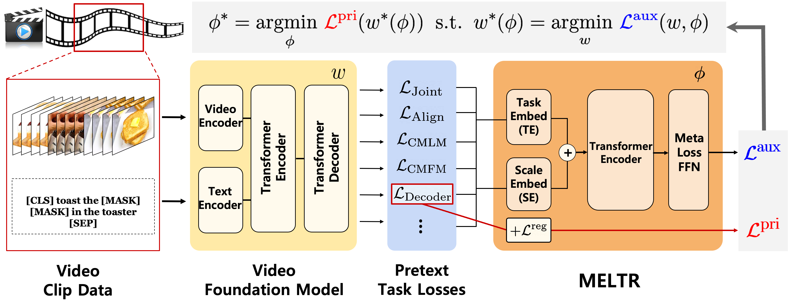

# MELTR: Meta Loss Transformer for Learning to Fine-tune Video Foundation Models

This is the official implementation of MELTR (CVPR 2023). ([Arxiv](https://arxiv.org/abs/2303.13009))

> Dohwan Ko<sup>1*</sup>, Joonmyung Choi<sup>1*</sup>, Hyeong Kyu Choi<sup>1</sup>, Kyoung-Woon On<sup>2</sup>, Byungseok Roh<sup>2</sup>, Hyunwoo J. Kim<sup>1</sup>.
>
> <sup>1</sup>Korea University  <sup>2</sup>Kakao Brain


<div align="center">
  
</div>


Code will be available soon!


## Citation

```
@inproceedings{ko2023meltr,
  title={MELTR: Meta Loss Transformer for Learning to Fine-tune Video Foundation Models},
  author={Ko, Dohwan and Choi, Joonmyung and Choi, Hyeong Kyu and On, Kyoung-Woon and Roh, Byungseok and Kim, Hyunwoo J},
  booktitle={Proceedings of the IEEE/CVF Conference on Computer Vision and Pattern Recognition},
  year={2023}
}
```
